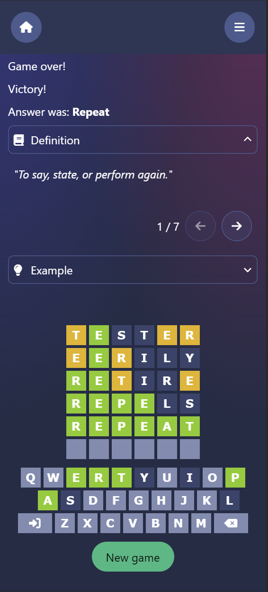

# Gordle

## Description

This is a copy of the Wordle word guessing game. Players have limited amount of tries to guess the correct word. Information about correct, contained or incorrect characters are given for each new guess.

The project is a learning process for me about the Go programming language. That is where the name Go + Wordle => Gordle comes from.

The application has been built with Go in the backend and Svelte in the frontend. The application reaches out to APIs of dictionaries to fetch the word definitions and examples, if available.

### Technologies

- Go, in the backend
- PostgreSQL database (prod), SQLite (dev) with GORM as the relational mapper
- Gin as the REST API backend library
- WordsAPI and Kielitoimisto as the dictionaries for English and Finnish words, respectively
- Svelte in the frontend with SkeletonUI + Tailwind as the component libraries
- ChartJs for the statistics data visualization
- i18next for the internationalization
- Docker for containerization, Fly.io for hosting backend and Vercel for hosting frontend, Github Actions for CI/CD

### Sources

- [WordsAPI](https://www.wordsapi.com/)
- [Kielitoimisto](https://www.kielitoimistonsanakirja.fi/#/)
- [English answers](https://www.thefreedictionary.com/)
- [Finnish answers](https://www.kotus.fi/aineistot/sana-aineistot/nykysuomen_sanalista)
- [Flag icons](https://flagpedia.net/)
